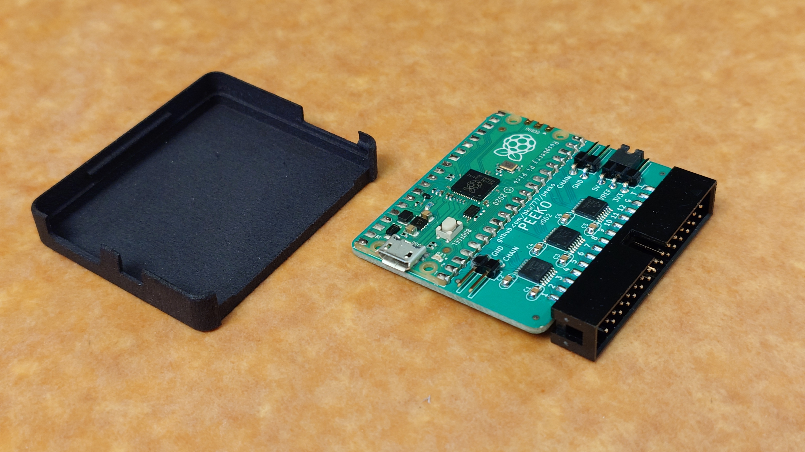
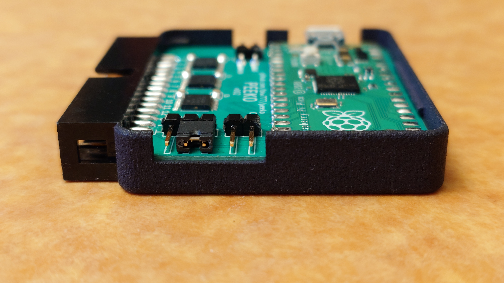
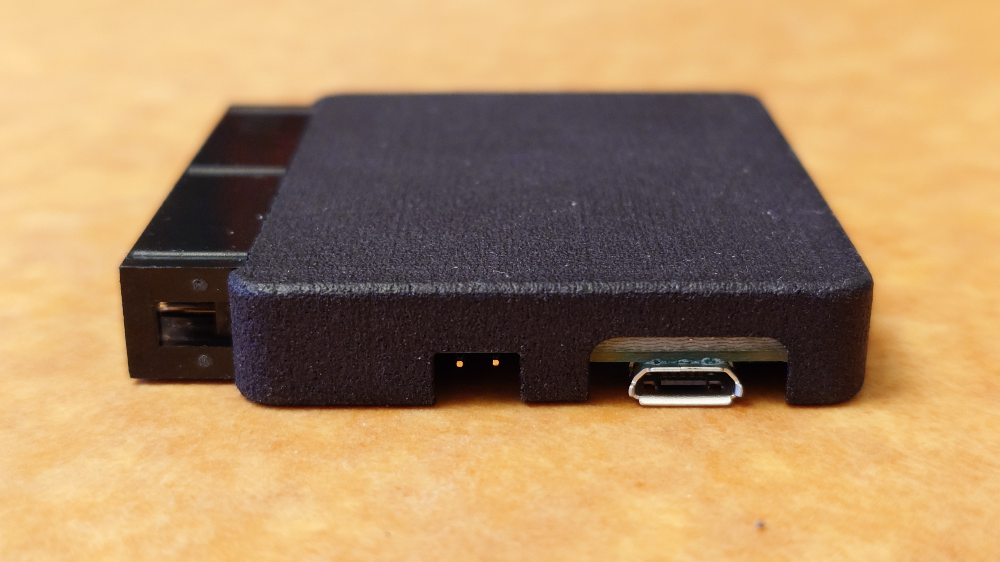
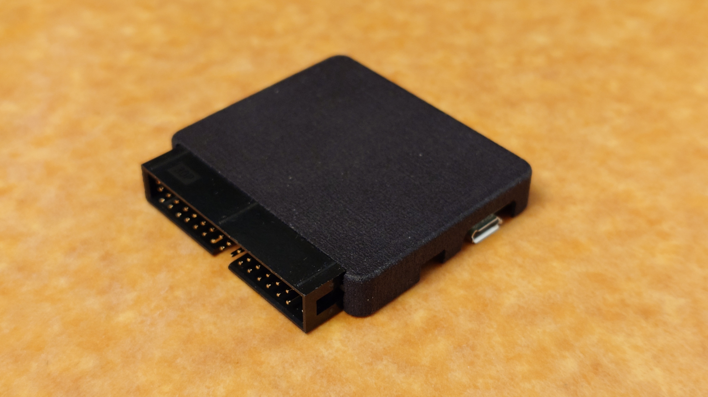
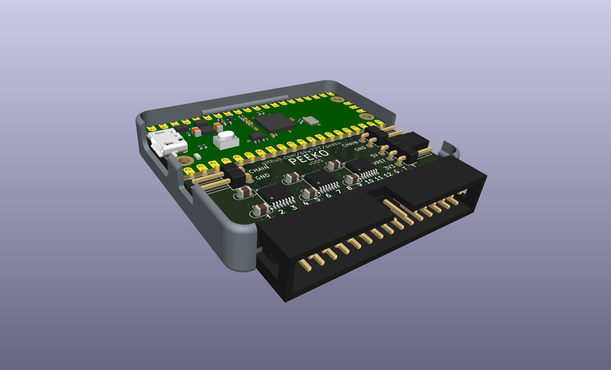
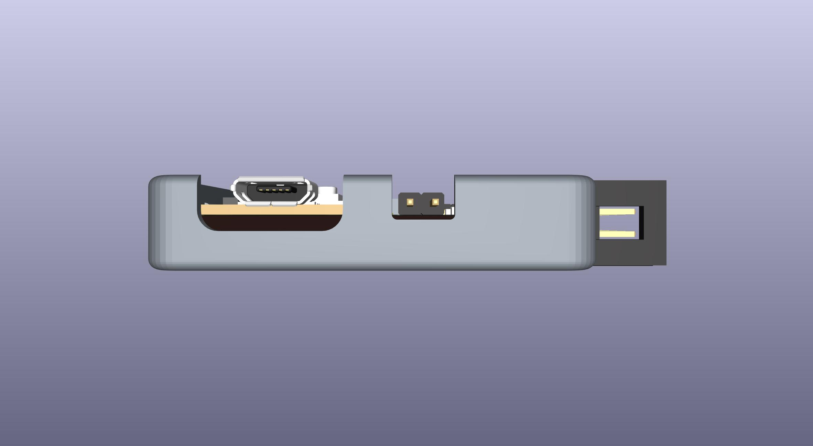
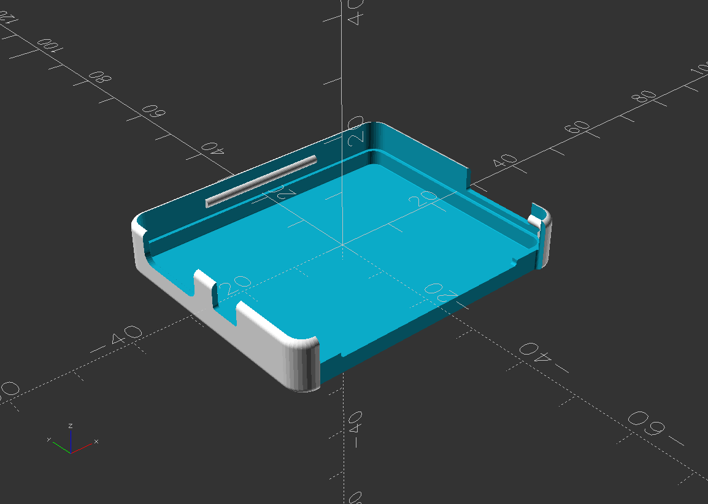
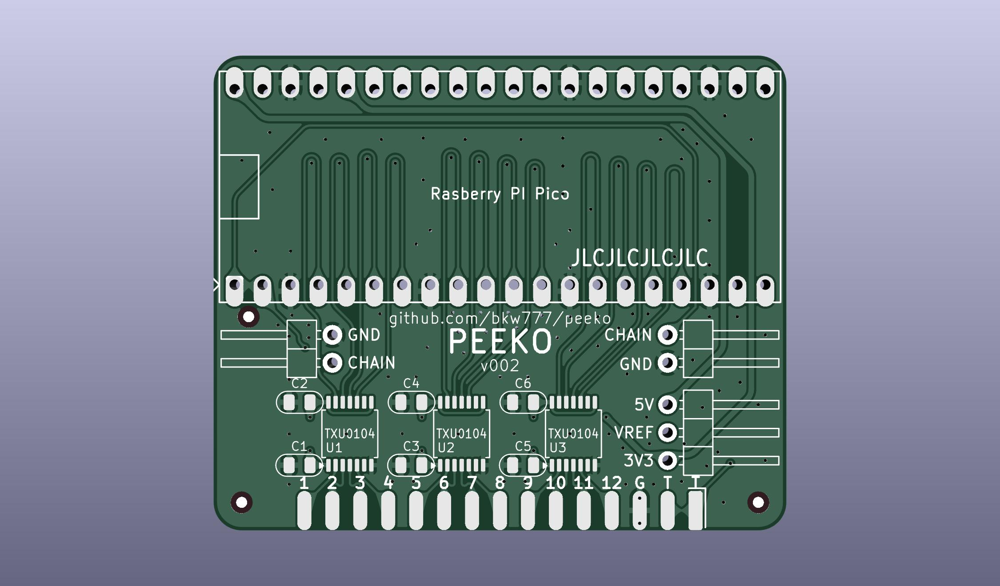
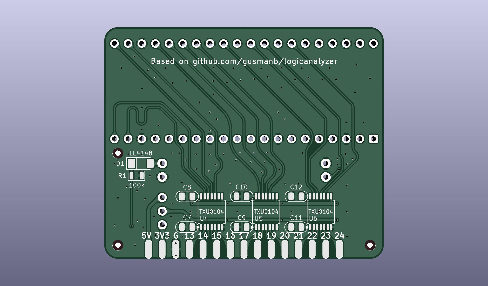
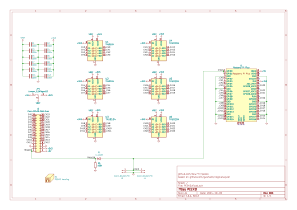

# PEEKO

Alternate PCB for [gusmanb/logicanalyzer](https://github.com/gusmanb/logicanalyzer)

[PEEKO.bom.csv](PCB/out/PEEKO.bom.csv)

# BOM

[DigiKey](https://www.digikey.com/short/h755hpzf)  ([PEEKO.bom.csv](PCB/out/PEEKO.bom.csv))

<!--
Alternate parts for chain:  
[header molex 2-pin male r/a](https://www.digikey.com/en/products/detail/molex/1718574002/5116867)  
[cable molex 2-pin female-female 150mm](https://www.digikey.com/en/products/detail/molex/2177961021/14637993)  
TODO:  
* Zigzag pico pin holes  
  so pico can be installed removable with only male pins soldered to the pico  
  this elevates the pico by the same amount as the molex pin headers over the plain pin headers (2.54mm)  
* Version of enclosure with 2.54mm taller walls  
* Lid to close up the enclosure, with opening for heat sink for overclocked pico2
* Printable legend for the input pins
-->

# PROBES

Cable: https://www.digikey.com/en/products/detail/digilent-inc/310-064/5848557

Mini-grabbers: [terrible](https://www.amazon.com/dp/B07BCZSNGS), [good](https://amazon.com/dp/B09TPBS7YF/147-7256223-7410705), [expensive](https://www.amazon.com/dp/B00R3R7IVC)

# FIRMWARE

Download *-PICO.uf2 from https://github.com/gusmanb/logicanalyzer/releases  
Hold BOOTSEL button while connecting usb.  
Drag *-PICO.uf2 onto the RPI-RP2 drive.

PICO will reboot itself immediately and RPI-RP2 drive will disappear. PEEKO is ready to use.

# USAGE

For software, firmware, & directions, see [gusmanb/logicanalyzer/wiki](https://github.com/gusmanb/logicanalyzer/wiki)

# Other Versions

Brute-force diode-clamping version: [brute-clamp](brute-clamp.md)
