# PEEKO

Alternate PCBs for [gusmanb/logicanalyzer](https://github.com/gusmanb/logicanalyzer)

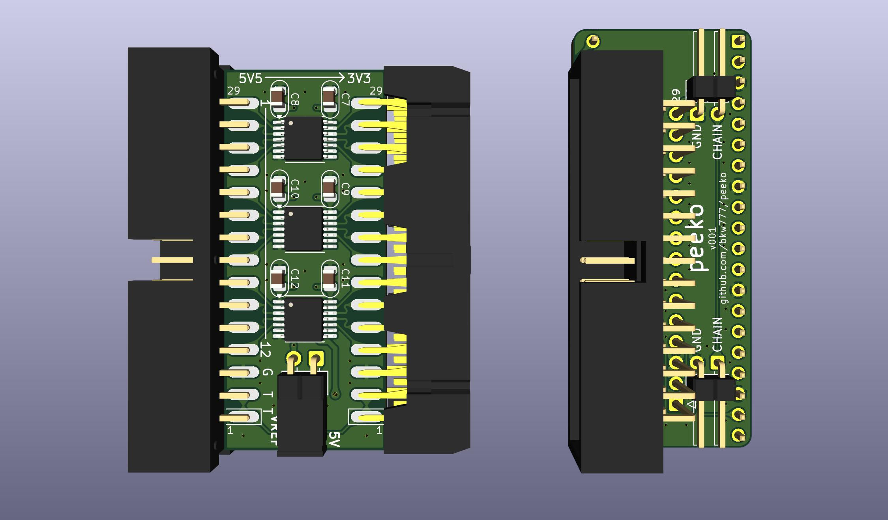
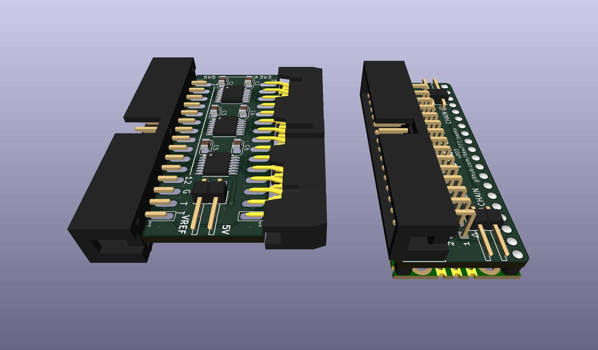
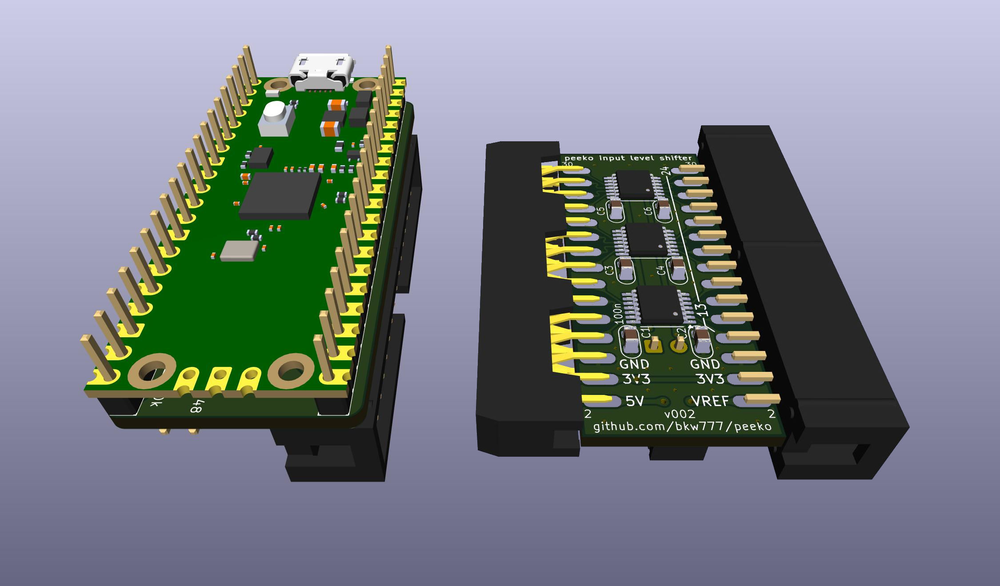

# peeko  
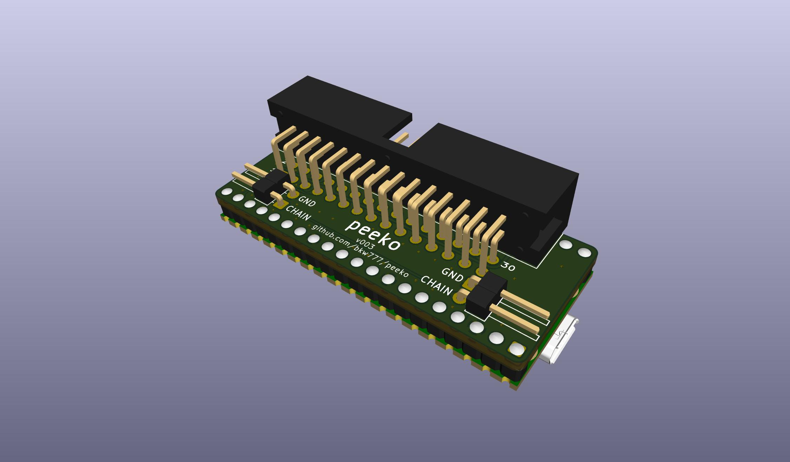
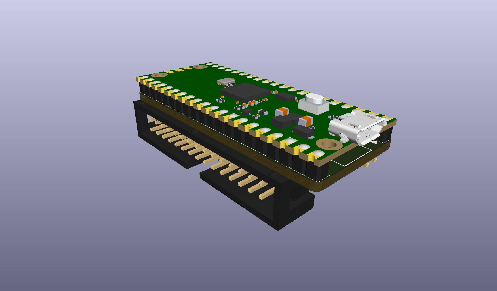
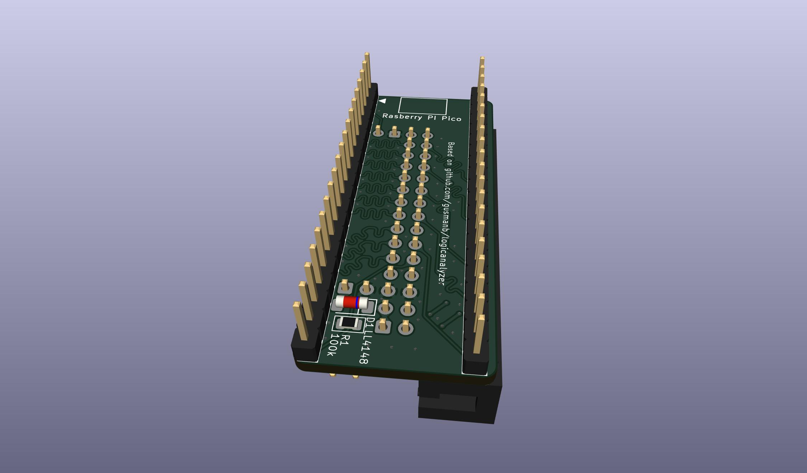
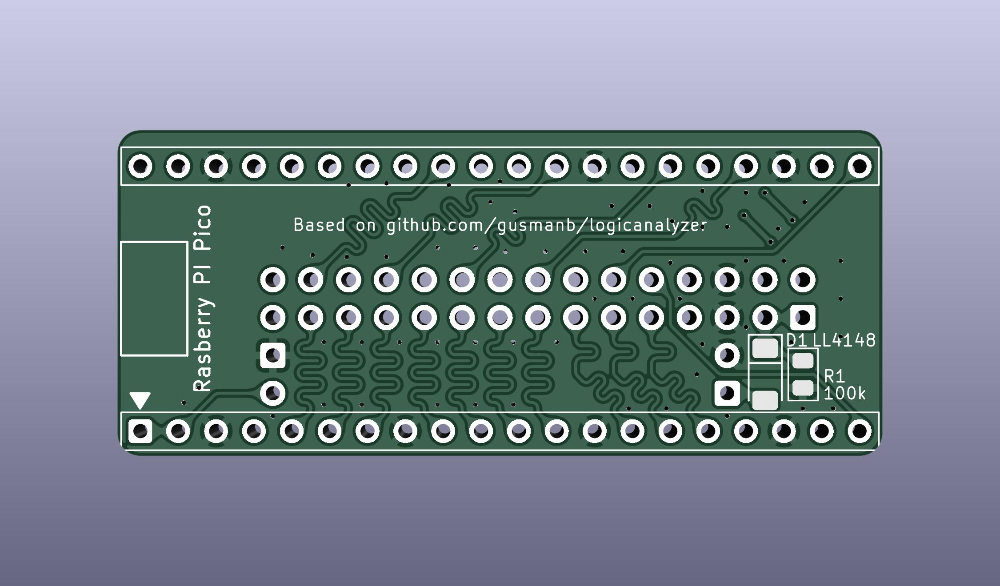
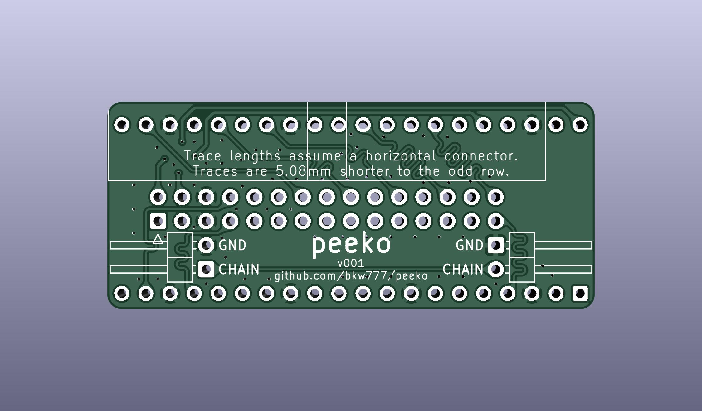
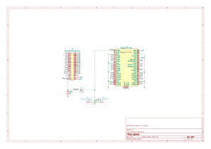

# input level shifter
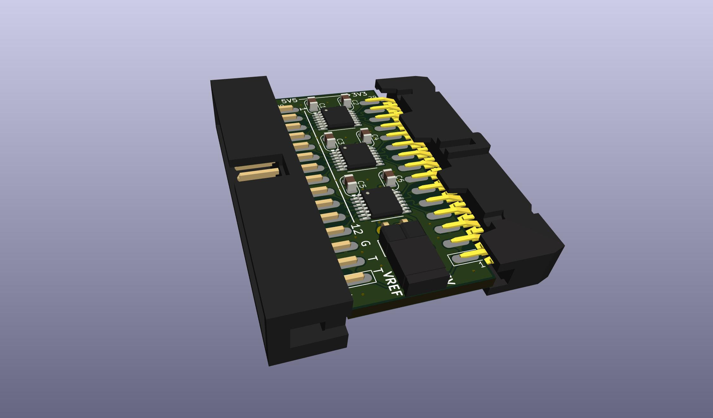
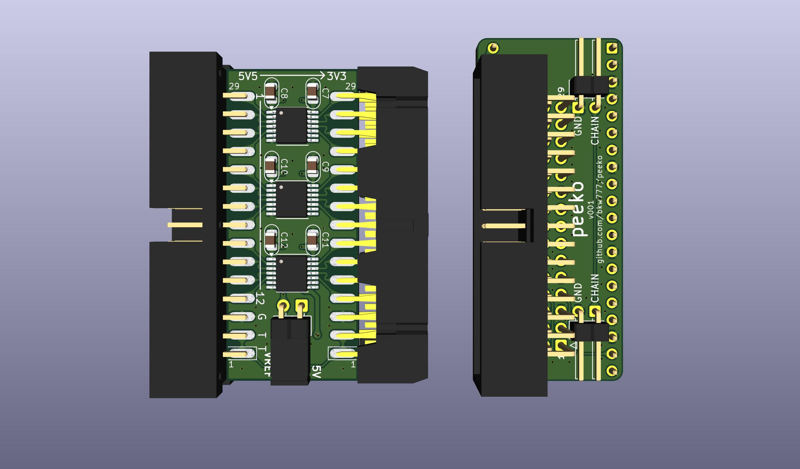
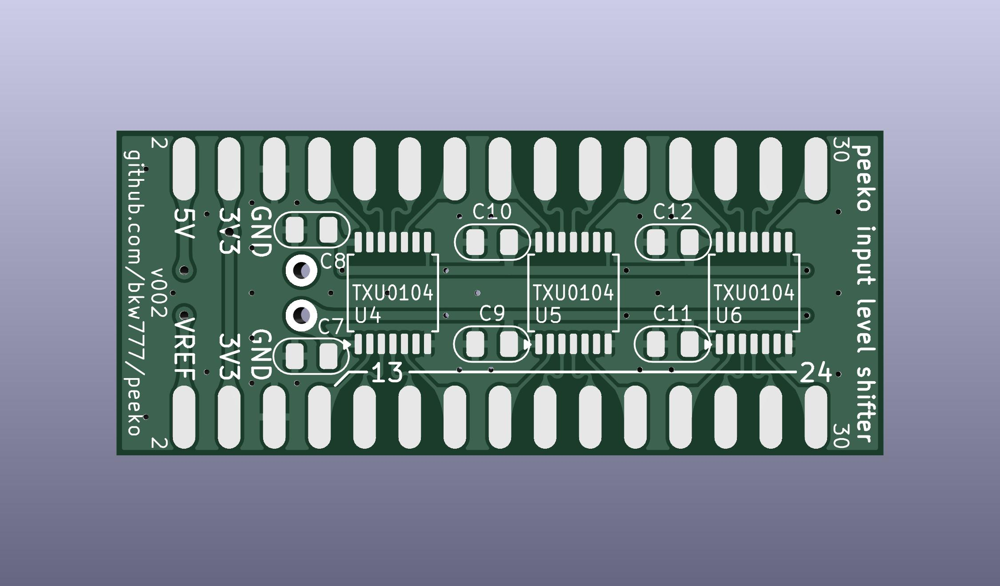
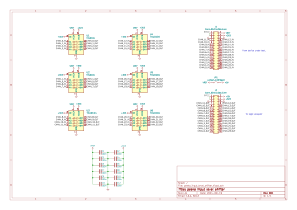

# bom
BOM for the peeko & level shifter  
[DigiKey cart](https://www.digikey.com/short/hmhjtdmn)  
[peeko_and_level_shifter_digikey.bom.csv](peeko_and_level_shifter_digikey.bom.csv)

# housing
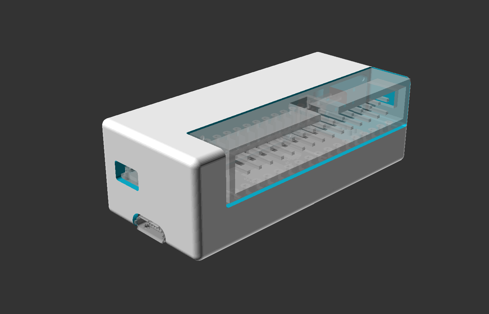
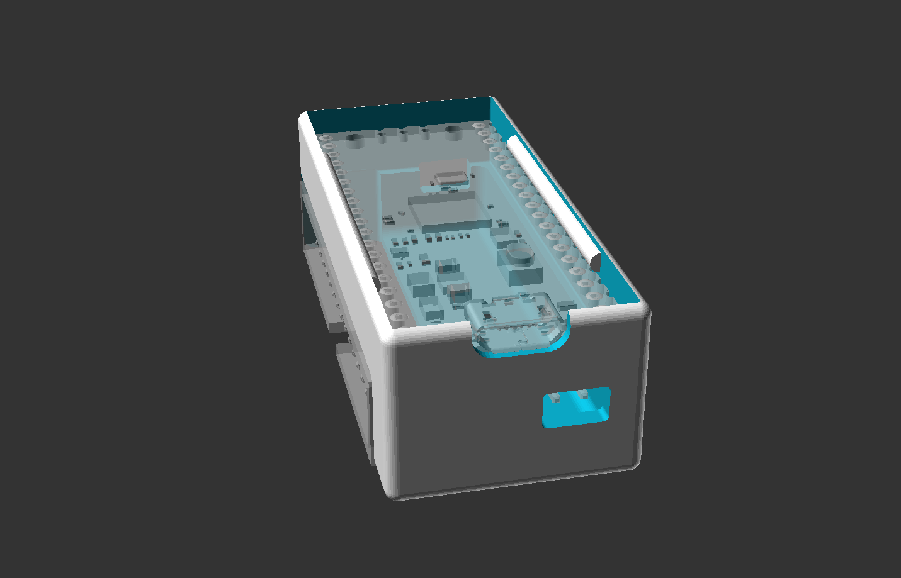

# building
The order you solder the parts matters.  
Solder everything on the Pico side first, but not the Pico itself, just the pins, diode, resistor.  
Then flush cut the bottoms of the Pico pins, at least where the IDC connector will lay.  
Then solder the bottom side parts. No need to flush cut any.  
Lastly solder the Pico to the pins and flush-cut the tops.

For the fly wires, peel 10 wires off the female jumper cable to leave 30 wires together.  
Cut the ribbon in half right in the middle, try to cut at exactly 90 degrees.  
Crimp the 30-pin female IDC connectors on the cut ends to make 2 6-inch cables.  
Or cut closer to one side to make a single longer cable.

Or remove both the cable and the IDC connectors from the cart and here is another option for a pre-made fly wire cable:  
https://www.digikey.com/en/products/detail/digilent-inc/310-064/5848557

# mini-grabbers
For mini-grabbers, they are expensive on digikey so they are not in the bom.  

If you enjoy being miserable:  
https://www.amazon.com/DIYhz-Colors-Grabbers-Electronic-Experiment/dp/B07BCZSNGS  
They are really terrible because the metal is weak and the hooks fall off.

If you are rich, then why are you here instead of just buying a proper DSLogic?:  
https://www.amazon.com/Micro-Hook-Double-Grabber-Test-Connector/dp/B00R3R7IVC  
These are good but that would be $100

These are good. Not as fine tipped as the E-Z Hooks, but small enough for 0.1" legs. Pretty good construction and operation.  
https://www.amazon.com/Goupchn-Grabber-Analyzer-Electronic-Testing/dp/B09TPBS7YF/147-7256223-7410705  

# peeko_jy

An alternate version with the Jason Yang integrated level-shifting, 4-layer pcb.  
It looks pretty, and I've redrawn it to be even prettier, but I think this must be pretty abusive to both the RP2040 and the circuit under test so I don't really recommend it.

Maybe swap out the BAV99 for BAV7004. Faster switching time, lower forward voltage.  
And maybe swap the 220 ohms for 470, 1k, even 4.7k if you don't need the full 100msps (only good to about 10mhz signals). Higher resistance means less current but also slower rise time.

The good thing about this one is it can handle both higher than 5v and lower than 0v. But the higher the input voltage, the higher the current.

5v input probably means about 4.5ma load on the target, and you're still overdriving the pico input to about 4v.  
12v input probably means about 36ma load on the target.  
-12v input probably means about 50ma, and passing about -1v to the pico input.

I have not verified any of this for real.

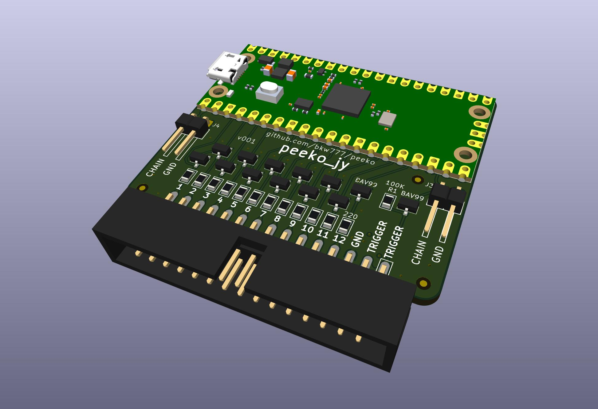
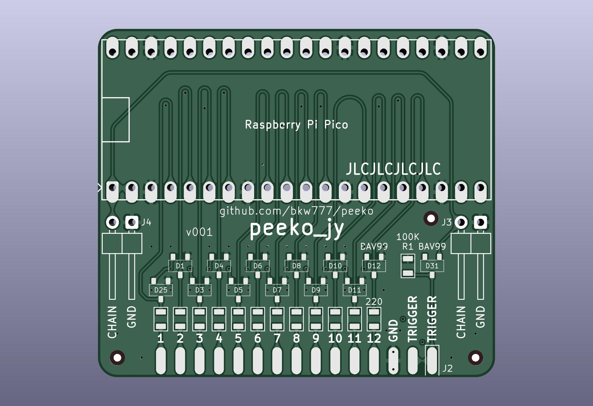
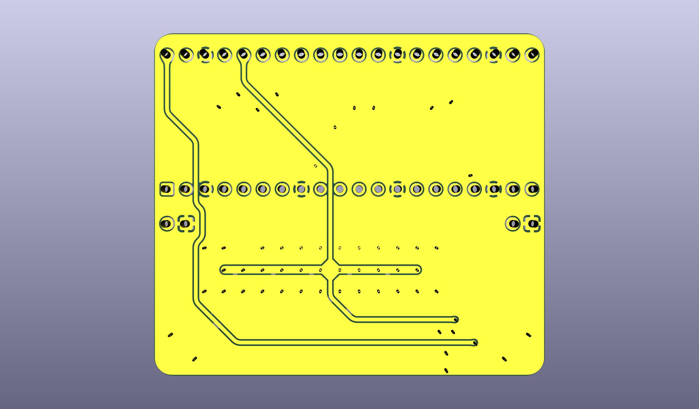
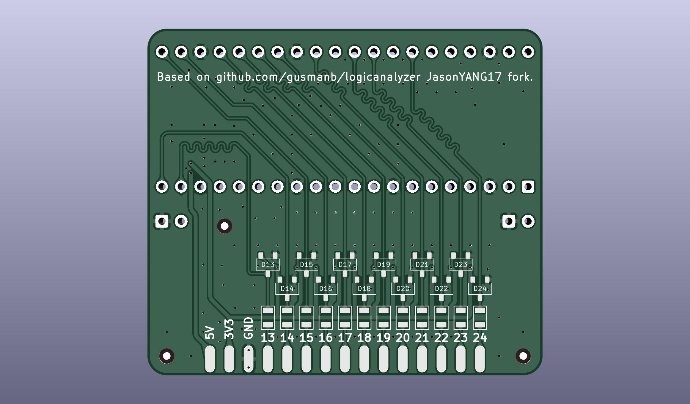
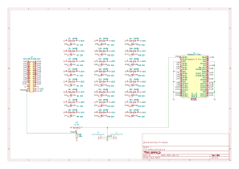

# usage
For software, firmware, & directions, see [gusmanb/logicanalyzer](https://github.com/gusmanb/logicanalyzer)
