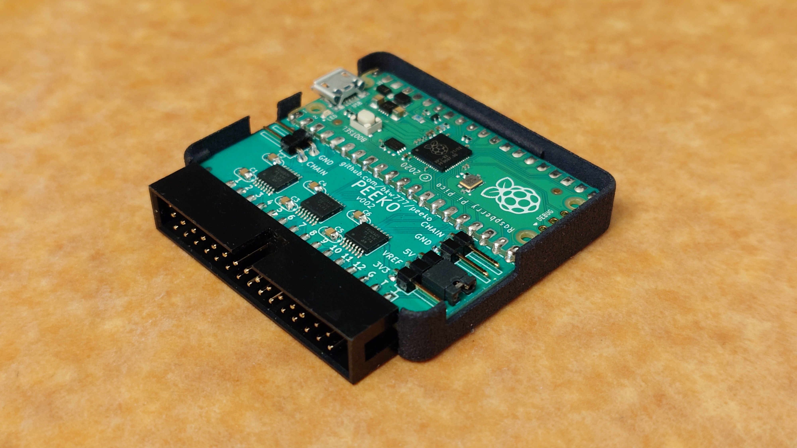
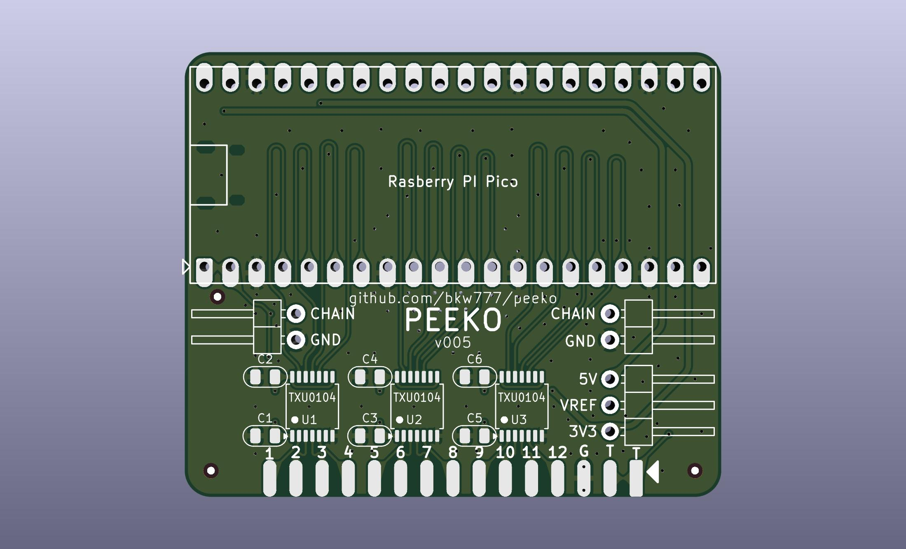

# PEEKO

Alternate PCB for [gusmanb/logicanalyzer](https://github.com/gusmanb/logicanalyzer)

[PEEKO.bom.csv](PCB/out/PEEKO.bom.csv)

# BOM

[DigiKey](https://www.digikey.com/short/h755hpzf)  ([PEEKO.bom.csv](PCB/out/PEEKO.bom.csv))

# PROBES

Cable: https://www.digikey.com/en/products/detail/digilent-inc/310-064/5848557

Mini-grabbers: [terrible](https://www.amazon.com/dp/B07BCZSNGS), [good](https://amazon.com/dp/B09TPBS7YF/147-7256223-7410705), [expensive](https://www.amazon.com/dp/B00R3R7IVC)

# FIRMWARE

Download *-PICO.uf2 from https://github.com/gusmanb/logicanalyzer/releases  
Hold BOOTSEL button while connecting usb.  
Drag *-PICO.uf2 onto the RPI-RP2 drive.

PICO will reboot itself immediately and RPI-RP2 drive will disappear. PEEKO is ready to use.

# USAGE

For software, firmware, & directions, see [gusmanb/logicanalyzer/wiki](https://github.com/gusmanb/logicanalyzer/wiki)

# Other Versions

Brute-force diode-clamping version: [brute-clamp](brute-clamp.md)
