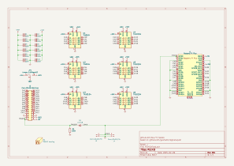

# PEEKO

Alternate PCB for [gusmanb/logicanalyzer](https://github.com/gusmanb/logicanalyzer)

# BOM

[PEEKO DigiKey cart](https://www.digikey.com/short/nvf3b2qt)  ([PEEKO.DigiKey.bom.csv](peeko.digikey.bom.csv))

# PROBES

The BOM includes parts to make 1 12" or 2 6" cables with a 30-pin connector on one end and individual female fly wires on the other end.

Peel 10 wires off of the ribbon cable to leave 30 wires together.  
Cut the 30-pin ribbon in half in the middle.  
Crimp the 30-pin female IDC connectors on the cut ends to make 2 6-inch cables.  

Or remove both the cable and the IDC connectors from the cart and here is a pre-made cable:  
https://www.digikey.com/en/products/detail/digilent-inc/310-064/5848557

Mini-grabbers: [terrible](https://www.amazon.com/dp/B07BCZSNGS), [good](https://amazon.com/dp/B09TPBS7YF/147-7256223-7410705), [expensive](https://www.amazon.com/dp/B00R3R7IVC)

# Other Versions

[brute-clamp](brute-clamp.md)

# USAGE

For software, firmware, & directions, see [gusmanb/logicanalyzer](https://github.com/gusmanb/logicanalyzer)
