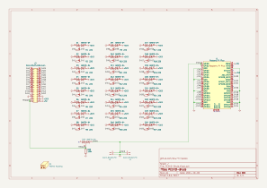

# PEEKO-Brute

Re-drawn version of the Jason Yang PCB from [gusmanb/logicanalyzer](https://github.com/gusmanb/logicanalyzer)

# BOM
[PEEKO-Brute DigiKey cart](https://www.digikey.com/short/7wdbdp9q)  ([PEEKO-Brute.DigiKey.bom.csv](PEEKO-Brute.DigiKey.bom.csv))

# Description

This is a re-drawn version of the Jason Yang board, which does level-shifting via diode-clamping.

This is pretty brute-force and pretty abusive to both the circuit under test and the pico, but can also handle voltages much lower than 0v and much higher than 5v.

Changes:  
* simpler cleaner traces  
* schottky diodes
* 2-layer PCB  
* schematic
* KiCAD

The good thing about this is that it can handle levels below 0v and above 5v.

The bad thing about this is that it loads the circuit under test, *hard*.

For a 12v input signal, the Pico inputs will still be over-driven a little to almost 4v, and it will try to draw at least 36ma from the driver generating the signal.  
For -12v, the Pico input sees -0.5v and pulls around 50ma from the source.

Depending on what the circuit under test actually is, maybe this burns out the output drivers on some chips, or maybe they can handle it, or maybe the signal gets pulled down to 4v when the rest of the circuit expects 12v.

12v is an extreme example, and at 5v the numbers get smaller and better, but don't go away.
