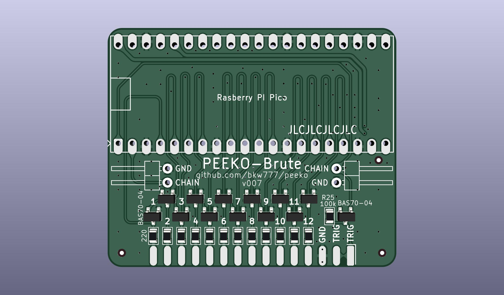

# PEEKO-Brute

Re-drawn version of the Jason Yang PCB from [gusmanb/logicanalyzer](https://github.com/gusmanb/logicanalyzer)

# BOM
[PEEKO-Brute DigiKey cart]()  ([PEEKO-Brute.DigiKey.bom.csv](PEEKO-Brute.DigiKey.bom.csv))

# Description

This is a re-drawn version of the Jason Yang board, which does level-shifting via diode-clamping.

This is pretty brute-force and pretty abusive to both the circuit under test and the pico, but can also handle voltages much lower than 0v and much higher than 5v.

Changes:  
* simpler cleaner traces  
* only 2-layer PCB needed  
* KiCAD instead of Eagle (original had only a pcb export in kicad with no schematic)

The good thing about this is that it can handle levels below 0v and above 5v.

The bad thing about this is that it loads the circuit under test, *hard*.

For a 12v input signal, the Pico inputs will still be over-driven to at least 4v, and it will try to draw at least 36ma from the poor driver generating the signal.  
For -12v, the Pico input sees -1v to -1.5v and pulls around 50ma from the source.

Depending on what the circuit under test actually is, maybe this burns out the driver outputs on some poor chips, or maybe they can handle it, or maybe the signal gets pulled down to 4v when the rest of the circuit expects 12v.

12v is an extreme example, and at 5v the numbers get smaller and better, but don't go away.

## possible changes

### Change BAV99 to [BAS7004](https://www.digikey.com/en/products/detail/infineon-technologies/BAS7004E6327HTSA1/506301)

Faster switching speed and lower forward voltage.

Lower Vf means that when it's trying to pull a high level down to 3V3, it gets closer to 3V3, and over-drives the Pico input by less.

The Pico datasheet says not to exceed 300mv over VIO. This probably still exceeds that at the expected current levels, but it's at least close, maybe even within spec for 5v inputs if not for 12v.

### Change 220ohm to 470, 1K, even 4.7K

The higher the resitance, the less current goes throug, but also the slower the rise time.

So you won't be able to measure the full 100Ms/s with higher resistor values.

100Ms/s is only good for about 10MHz signals already, so you need to be working with even slower signals for this.
